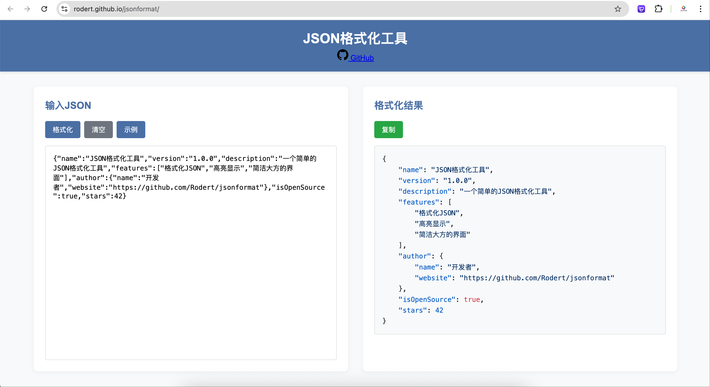

# JSON格式化工具

一个简洁大方的在线JSON格式化工具，可以快速格式化、美化和验证JSON数据。

[https://rodert.github.io/jsonformat/](https://rodert.github.io/jsonformat/)

## 功能特点

- 即时JSON格式化和验证
- 语法高亮显示
- 左侧输入，右侧实时预览
- 简洁大方的用户界面
- 支持复制格式化后的JSON
- 提供示例JSON数据
- 响应式设计，适配移动设备

## 在线体验

访问 [GitHub Pages](https://Rodert.github.io/jsonformat/) 即可在线使用该工具。



## 本地运行

1. 克隆仓库
   ```
   git clone https://github.com/Rodert/jsonformat.git
   ```

2. 进入项目目录
   ```
   cd jsonformat
   ```

3. 使用浏览器打开 `index.html` 文件即可

## 桌面离线版

本项目已加入 Electron 桌面离线版配置，可通过 GitHub Actions 自动构建 Windows 安装包，并上传到 GitHub Releases。

### 触发 Release 构建

方式一：推送到 `main` 分支

每次推送到 `main` 分支都会自动构建一版桌面离线包，并发布到 GitHub Releases。Release 版本号会自动使用：

```text
YYYYMMDD-短commit
```

例如：

```text
20260512-a1b2c3d
```

对应的 Release tag 会使用：

```text
desktop-20260512-a1b2c3d
```

方式二：手动触发

在 GitHub 仓库的 Actions 页面手动运行 `Build Desktop Releases`。如果不填写版本号，会自动使用日期和当前 commit；如果填写版本号，则 Release 使用你填写的版本号。

历史方式：手动打标签仍然可用于代码管理，但桌面包构建不再依赖 `v*` 标签触发。

```bash
git tag v1.0.0
git push origin v1.0.0
```

### 构建产物

工作流会生成并上传以下离线桌面包：

- Windows x64 安装版：`JavaPub Tools-日期.commit-windows-x64-setup.exe`
- Windows x64 便携版：`JavaPub Tools-日期.commit-windows-x64-portable.exe`

桌面版会直接加载仓库内的静态页面，工具逻辑仍然在本地浏览器内核中运行，不上传服务器。

### 本地调试桌面版

```bash
npm ci
npm run start
```

本地打包：

```bash
npm run dist:win
```

当前自动发布仅构建 Windows x64 包。未签名包在 Windows 上可能出现 SmartScreen 安全提示，正式分发时可再配置代码签名。

## 部署到GitHub Pages

### 自动部署（推荐）

本项目已配置GitHub Actions自动部署功能，只需以下步骤：

1. Fork 本仓库
2. 进入仓库设置 (Settings)
3. 在左侧菜单找到 "Pages"
4. 在 "Source" 部分，选择 "GitHub Actions"
5. 完成后，每次推送到main分支时，将自动部署到GitHub Pages
6. 部署完成后，您的网站将在 `https://Rodert.github.io/jsonformat/` 上线

### 手动部署

如果您不想使用自动部署，也可以手动部署：

1. Fork 本仓库
2. 进入仓库设置 (Settings)
3. 在左侧菜单找到 "Pages"
4. 在 "Source" 部分，选择 "Deploy from a branch"
5. 选择 "main" 分支和 "/ (root)" 文件夹
6. 点击 "Save" 按钮
7. 等待几分钟后，您的网站将在 `https://Rodert.github.io/jsonformat/` 上线

## 技术栈

- HTML5
- CSS3
- JavaScript (ES6+)
- highlight.js (用于语法高亮)

## 许可证

MIT

## 贡献

欢迎提交 Issue 或 Pull Request 来改进这个项目！
